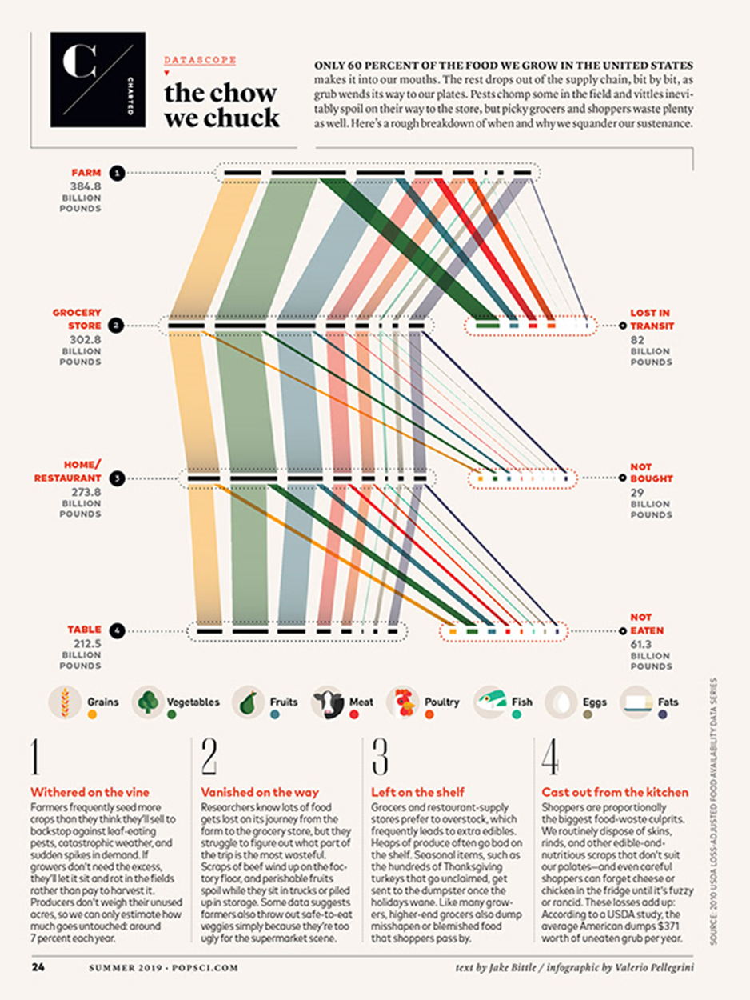

# Data Visualization

## Assignment 2: Good and Bad Data Visualization

### Requirements:

- Data visualizations are important tools for communication and convincing; we need to be able to evaluate the ways that data are presented in visual form to be critical consumers of information 
- To test your evaluation skills, locate two public data visualizations online, one good and one bad  
    - You can find data visualizations at https://public.tableau.com/app/discover or https://datavizproject.com/, or anywhere else you like! 
- For each visualization (good and bad):  
    - Explain (with reference to material covered up to date, along with readings and other scholarly sources, as needed) why you classified that visualization the way you did.
      ```
      Your answer...

World Heritage Sites Staircase      

I consider the following image to be a good visualization.


Taken from https://100.datavizproject.com/data-type/viz40/

This image portrays a staircase. The staircase steps represent the number of World Heritage sites. The visualization's focus is on the development of world heritage sites from 2004 to 2022 in absolut numbers.

In class we learned that when analyzing visualizations, we must consider three things: 
Is the visualization aesthetic?
Is the visualization substantive?
Is the visualization perceptual?

This image is simple, yet pleasing to look at. There are four icons dispersed along the staircase. Each icon on the stairs represents the country's flag, making it clear which country the number represents. The colours are not overwhelming and contrast nicely against the white background.

The staircase ascends from left to right. Each step is numbered in increments of one. The visualization shows the increase in the number of World Heritage sites from 2004 to 2022. The increase for each of the three countries (Denmark, Norway, and Sweden) is represented by a line in a different colour and the number of the increase in new sites is clearly displayed above the line. A unique colour colour represents each country and this colour is used to number the steps, the line, and the increase. For example, Sweden's flag is blue, the number 15, representing the number of sites, is blue, the line showing the increase from 13 to 15 is blue, and the number above the line is blue. This makes it very easy to tell which country is being represented.

The message is clear - There is an upward trend in the number of World Heritage sites in Denmark, Norway, and Sweden and although the increase in sites from 2004 to 2022 is the smallest in Sweden, Sweden has the largest number of sites.


The Chow We Chuck

I consider the following visualization to be a bad visualization



Taken from https://www.behance.net/gallery/80892469/POPULAR-SCIENCE-The-Chow-We-Chuck

The Chow We Chuck visualization includes text that explains the visual and has an attractive legend, but I consider it a bad visualization for the following reasons.

There are lines extending from lines and it is not immediately clear what the lines mean. The audience has to read the text in order to fully understand what the visual is about.

Another issue is the size of the text. There is a lot of text that explains the visual. Much of the text is small and inaccessible to persons with visual impairment.

Also, the lines are of differing widths. The visual does not explain if the thickness of the diagonal line is related to vertical line, representing a proportion of that line or if the thickness of the line is a proportion of the total to the right. 


      ```
    - How could this data visualization have been improved?  
      ```
      Your answer...
      The staircase visual could be improved by adding a title. Without the title, the audience has no idea what the image represents. The explanation is in the accompanying text, but a title would allow it to stand alone and be immediately understood.

      Another improvement would be to add a legend. The legend would explain the icons and the numbers so that someone without access to the text would understand the visualization.

      The Chow We Chuck visual could be improved in the following ways:

      The orange and pink lines are beside each other. The colours look so alike that it is hard to distinguish between the orange from the pink. One of the colours can be changed. For example, the orange can be changed to dark brown.

      The lines representing eggs and fish lost in transit, not bought, and not eaten, are so thin that persons with visual impairment may not see them. Making them thicker or bolder in colour would make those lines more visible to all.

      The lines extending from lines are a bit confusing. It may have been easier to see the see the same data in a bar graph or pie chart instead.


      
      ```
- Word count should not exceed (as a maximum) 500 words for each visualization (i.e. 
300 words for your good example and 500 for your bad example)

### Why am I doing this assignment?:

- This assignment ensures active participation in the course, and assesses the learning outcomes
* Apply general design principles to create accessible and equitable data visualizations
* Use data visualization to tell a story

### Rubric:

| Component               | Scoring   | Requirement                                                 |
|-------------------------|-----------|-------------------------------------------------------------|
| Data viz classification and justification | Complete/Incomplete | - Data viz are clearly classified as good or bad<br />- At least three reasons for each classification are provided<br />- Reasoning is supported by course content or scholarly sources |
| Suggested improvements  | Complete/Incomplete | - At least two suggestions for improvement<br />- Suggestions are supported by course content or scholarly sources |

## Submission Information

🚨 **Please review our [Assignment Submission Guide](https://github.com/UofT-DSI/onboarding/blob/main/onboarding_documents/submissions.md)** 🚨 for detailed instructions on how to format, branch, and submit your work. Following these guidelines is crucial for your submissions to be evaluated correctly.

### Submission Parameters:
* Submission Due Date: `23:59 - 02/03/2025`
* The branch name for your repo should be: `assignment-2`
* What to submit for this assignment:
    * This markdown file (assignment_2.md) should be populated and should be the only change in your pull request.
* What the pull request link should look like for this assignment: `https://github.com/<your_github_username>/visualization/pull/<pr_id>`
    * Open a private window in your browser. Copy and paste the link to your pull request into the address bar. Make sure you can see your pull request properly. This helps the technical facilitator and learning support staff review your submission easily.

Checklist:
- [ ] Create a branch called `assignment-2`.
- [ ] Ensure that the repository is public.
- [ ] Review [the PR description guidelines](https://github.com/UofT-DSI/onboarding/blob/main/onboarding_documents/submissions.md#guidelines-for-pull-request-descriptions) and adhere to them.
- [ ] Verify that the link is accessible in a private browser window.

If you encounter any difficulties or have questions, please don't hesitate to reach out to our team via our Slack. Our Technical Facilitators and Learning Support staff are here to help you navigate any challenges.
