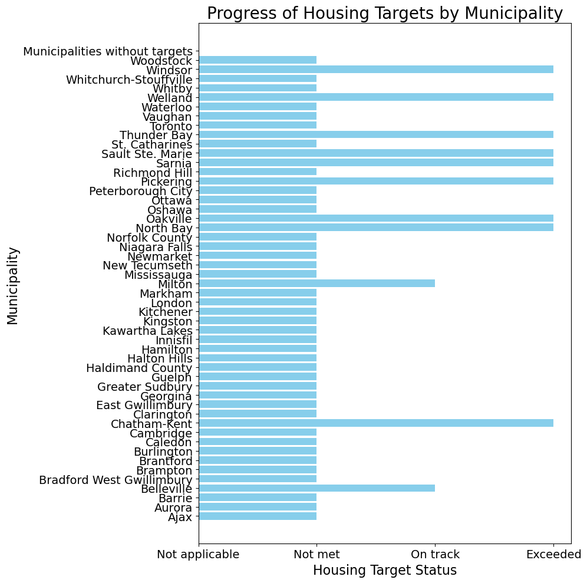
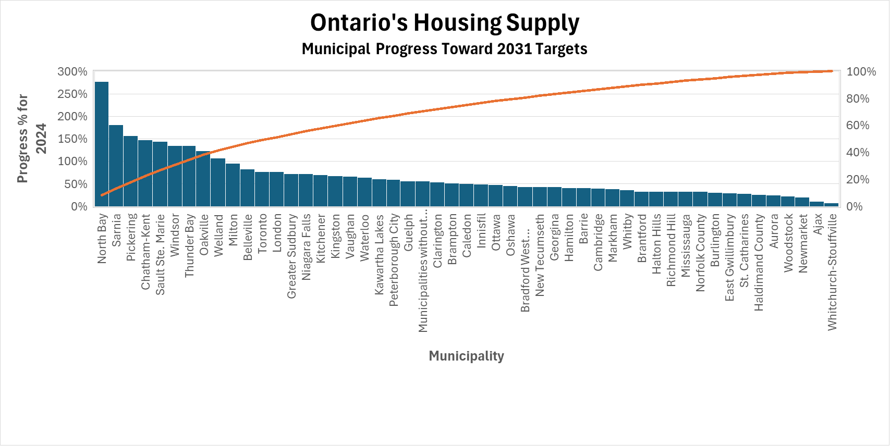

# Data Visualization

## Assignment 3: Final Project

### Requirements:
- We will finish this class by giving you the chance to use what you have learned in a practical context, by creating data visualizations from raw data. 
- Choose a dataset of interest from the [City of Toronto’s Open Data Portal](https://www.toronto.ca/city-government/data-research-maps/open-data/) or [Ontario’s Open Data Catalogue](https://data.ontario.ca/). 
- Using Python and one other data visualization software (Excel or free alternative, Tableau Public, any other tool you prefer), create two distinct visualizations from your dataset of choice.  
- For each visualization, describe and justify: 
    > What software did you use to create your data visualization?

    > Who is your intended audience? 
    
    > What information or message are you trying to convey with your visualization? 
    
    > What design principles (substantive, perceptual, aesthetic) did you consider when making your visualization? How did you apply these principles? With what elements of your plots? 
    
    > How did you ensure that your data visualizations are reproducible? If the tool you used to make your data visualization is not reproducible, how will this impact your data visualization? 
    
    > How did you ensure that your data visualization is accessible?  
    
    > Who are the individuals and communities who might be impacted by your visualization?  
    
    > How did you choose which features of your chosen dataset to include or exclude from your visualization? 
    
    > What ‘underwater labour’ contributed to your final data visualization product?

- This assignment is intentionally open-ended - you are free to create static or dynamic data visualizations, maps, or whatever form of data visualization you think best communicates your information to your audience of choice! 
- Total word count should not exceed **(as a maximum) 1000 words** 
 
### Why am I doing this assignment?:  
- This ongoing assignment ensures active participation in the course, and assesses the learning outcomes: 
* Create and customize data visualizations from start to finish in Python
* Apply general design principles to create accessible and equitable data visualizations
* Use data visualization to tell a story  
- This would be a great project to include in your GitHub Portfolio – put in the effort to make it something worthy of showing prospective employers!

### Rubric:

| Component         | Scoring  | Requirement                                                                 |
|-------------------|----------|-----------------------------------------------------------------------------|
| Data Visualizations | Complete/Incomplete | - Data visualizations are distinct from each other - Data visualizations are clearly identified - Different sources/rationales (text with two images of data, if visualizations are labeled) - High-quality visuals (high resolution and clear data) - Data visualizations follow best practices of accessibility |
| Written Explanations | Complete/Incomplete | - All questions from assignment description are answered for each visualization - Explanations are supported by course content or scholarly sources, where needed |
| Code              | Complete/Incomplete | - All code is included as an appendix with your final submissions - Code is clearly commented and reproducible |

## Submission Information

🚨 **Please review our [Assignment Submission Guide](https://github.com/UofT-DSI/onboarding/blob/main/onboarding_documents/submissions.md)** 🚨 for detailed instructions on how to format, branch, and submit your work. Following these guidelines is crucial for your submissions to be evaluated correctly.

### Submission Parameters:
* Submission Due Date: `23:59 - 09/03/2025`
* The branch name for your repo should be: `assignment-4`
* What to submit for this assignment:
    * A folder/directory containing:
        * This file (assignment_3.md)
        * Two data visualizations 
        * Two markdown files for each both visualizations with their written descriptions.
        * Link to your dataset of choice.
        * Complete and commented code as an appendix (for your visualization made with Python, and for the other, if relevant) 
* What the pull request link should look like for this assignment: `https://github.com/<your_github_username>/visualization/pull/<pr_id>`
    * Open a private window in your browser. Copy and paste the link to your pull request into the address bar. Make sure you can see your pull request properly. This helps the technical facilitator and learning support staff review your submission easily.

Checklist:
- [ ] Create a branch called `assignment-3`.
- [ ] Ensure that the repository is public.
- [ ] Review [the PR description guidelines](https://github.com/UofT-DSI/onboarding/blob/main/onboarding_documents/submissions.md#guidelines-for-pull-request-descriptions) and adhere to them.
- [ ] Verify that the link is accessible in a private browser window.

If you encounter any difficulties or have questions, please don't hesitate to reach out to our team via our Slack. Our Technical Facilitators and Learning Support staff are here to help you navigate any challenges.

Python Visualization
Bar Chart
Ontario's Housing Supply
Source: https://data.ontario.ca/dataset/ontario-s-housing-supply-progress/resource/3bb04ba5-2445-44e0-9d2c-8a25dd1b18e6

Written Explanation:

    What software did you use to create your data visualization?

The software used was Python. I used Python because this was the assignment requirement.

    Who is your intended audience? 

The general public.
    

    What information or message are you trying to convey with your visualization? 

The provincial government set housing targets for municipalities in Ontario. This graph shows the progress made by municipalities who were given targets to meet by the province. The y-axis lists the municipalities and the x-axis shows whether each municipality was able to meet their target, fell short of the target, or exceeded the target. Because I chose to focus on two pieces of information ( the municipalities and the housing target status), the visualization is simple and the trend can be observed quickly. The visualization shows that most municipalities have not met their housing target.

    
    What design principles (substantive, perceptual, aesthetic) did you consider when making your visualization? How did you apply these principles? With what elements of your plots? 

I considered substantive, perceptual, and aesthetic principles when making the visualization. Because this visualization is designed for the general public, my goal was to make it simple and easy to read. I considered using multiple colours but found that the graph looked too busy so I opted to use one colour. The graph is simple enough that advanced knowledge or skill is not required to read and understand it.
    

    How did you ensure that your data visualizations are reproducible? If the tool you used to make your data visualization is not reproducible, how will this impact your data visualization? 

My code does not include randomization, so I did not set a random seed. However, since I used all the data provided and the titles of the x and y axes are the titles of the columns used to create the visualization, I believe that someone wishing to reproduce the visual can use the same dataset and the code to reproduce the visualization. I also included comments with the code to explain the code.
    

    How did you ensure that your data visualization is accessible?  

The Visualization module slides advised that a minimum size 12 font should be used in data visualisation. I ensured that the visualization was accessible by using a minimum size of 14. I also uploaded the image to Microsoft Word and used their accessibility tool. The tool said that the image is accessible.
    

    Who are the individuals and communities who might be impacted by your visualization? 
Individuals and communities that might be impacted by the visualization are individuals in need of housing, organizations working with people in need of housing, municipal employees, or provincial policy makers. These individuals and communities will be interested in knowing which municipalities are meeting housing targets and which ones are falling short.

    
    How did you choose which features of your chosen dataset to include or exclude from your visualization? 

I wanted to look at municipalities general trend for meeting housing targets. Therefore I knew that one of the axes had to be "Municipalities". I also wanted to know whether most municipalities were able to meet their housing targets for 2024. I therefore chose the "Housing Target Status" for the second axes. I did not include data from the other columns because I was interested in seeing at a glance whether the targets were met or not and so used data relevant to my intention.

    What ‘underwater labour’ contributed to your final data visualization product?
    
Provincial bureaucrats who demanded the study, municipal employees who collected the data, data scientists who created the dataset, administrators who manage information, webmaster who put the dataset on the web, DSI staff.

Excel Visualization
Pareto Chart
Ontario's Housing Supply
Source: https://data.ontario.ca/dataset/ontario-s-housing-supply-progress/resource/3bb04ba5-2445-44e0-9d2c-8a25dd1b18e6

Written Explanation:

    
    What software did you use to create your data visualization?

The software used was Microsoft Excel. I used Excel because it produces functional and useful graphs.

    Who is your intended audience? 

The general public.
    

    What information or message are you trying to convey with your visualization? 

The provincial government set housing targets for municipalities in Ontario. This graph shows the progress made by municipalities who were given targets to meet by the province. The x-axis lists the municipalities and the y-axis shows the level of success each municipality has obtained in achieving their housing target. Because I chose to focus on two pieces of information ( the municipalities and the housing target progress), the visualization is simple and the progress can be observed quickly. The visualization shows that although a few municipalities have surpassed their housing targets, the vast majority of munucipalities are below their housing target.

    
    What design principles (substantive, perceptual, aesthetic) did you consider when making your visualization? How did you apply these principles? With what elements of your plots? 

I considered substantive, perceptual, and aesthetic principles when making the visualization. Because this visualization is designed for the general public, my goal was to make it simple and easy to read. The graph is simple enough that advanced knowledge or skill is not required to read and understand it.
    

    How did you ensure that your data visualizations are reproducible? If the tool you used to make your data visualization is not reproducible, how will this impact your data visualization? 

It may be hard to reproduce the visualization without the original excel file but since I did not remove any data and I used the datset column headings as the titles for the x and y axes anyone wanting to reproduce the visualization can download the dataset into excel and create a pareto chart using the same columns. 
    

    How did you ensure that your data visualization is accessible?  

The Visualization module slides advised that a minimum size 12 font should be used in data visualisation. I ensured that the visualization was accessible by using a minimum size of 12 throughout. I also uploaded the image to Microsoft Word and used their accessibility tool. The tool said that the image is accessible.
    

    Who are the individuals and communities who might be impacted by your visualization? 

Individuals and communities that might be impacted by the visualization are individuals in need of housing, organizations working with people in need of housing, municipal employees, or provincial policy makers. These individuals and communities will be interested in knowing what progress municipalities have made towards reaching their housing targets.

    
    How did you choose which features of your chosen dataset to include or exclude from your visualization? 

I wanted to look at the progress made by municipalites towards meeting their housing targets. I also wanted to know whether most municipalities were able to meet their housing targets for 2024. I therefore chose "Municipalities" for the first axis and the "Progress % for 2024" for the second axis. I excluded data from the other columns because I wanted to keep it simple and focus on just this information.

    What ‘underwater labour’ contributed to your final data visualization product?
Provincial bureaucrats who demanded the study, municipal employees who collected the data, data scientists who created the dataset, administrators who manage information, webmaster who put the dataset on the web, DSI staff.
